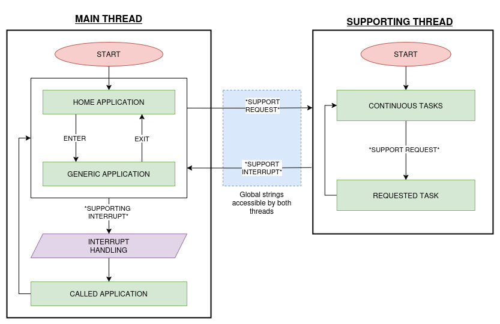
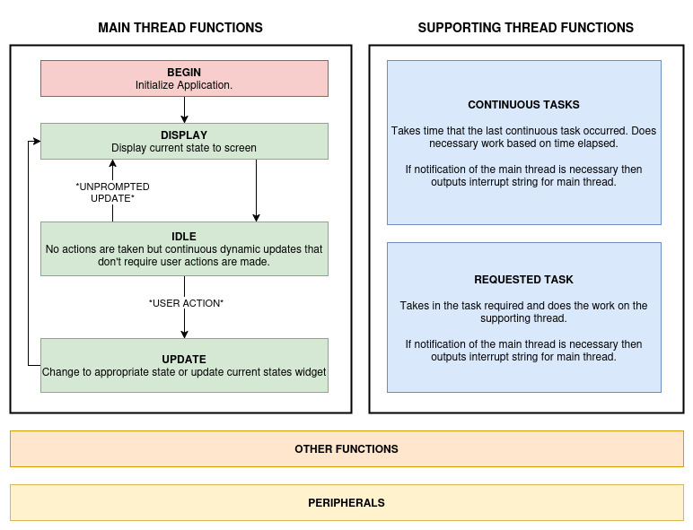
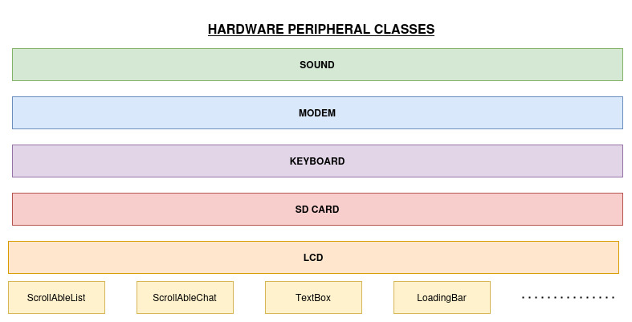

# myPHONE: A phone that I made for me.

# FIRMAWARE

## Architechture

The work is split across the two cores of the ESP32. The main thread handles all the bulk of the work from the applications. The supporting thread does tasks for the main thread applications that would otherwise take away from the continuous flow of the main thread. 

### Main Thread
On start up the main thread enters the home application. The user can enter and exit applications from the home application. The home application is also a derivation of the app class with same structure. 

Every application must check for interrupts from supporting thread in idle state. When a supporting interrupt occurs, the interrupt handler decides which application to start in response to the interrupt. 

### Supporting Thread
On start up the supporting thread enters the continuous task function. Here, it calls the continuous function of every application that requires continuous support. The supporting thread keeps track of time and passes time since of last call to the continuous tasks and the continuous tasks themselves decides if they should run.

At the end of every continuous task, the thread checks for support request. If there is a request, the request task function of the necessary application is called.

Continuous or requested tasks may output an interrupt for the main thread that is shared via the global interrupt string. 

## APPLICATION CLASS

All applications are inherited classes of the application class.

### Main Thread
Applications on the main thread have different states that can be traversed by taking actions with buttons. Actions may not change states but may just update widgets. Main thread functions MUST be overridden to preserved architecture. When an application is begun, an interrupt can be passed to it to the ensure that it handles the called interrupt.

### Supporting Thread
The continuous and requested functions are used by the supporting thread. The continuous function is for performing repeated actions at fixed intervals that are required by the application. The requested function is for making asynchronous requests for work from the supporting thread.

### Other
Other functions are unique to each inherited application class and are called by the main and supporting thread functions where they are needed. Hardware peripherals are interfaced with using peripheral classes. Global peripheral objects are created at startup and are passed to as class variables to the applications that need them. The application can call the peripherals functions as needed.

## PERIPHERAL CLASSES

### General Peripherals
Hardware peripheral classes follow no specific architecture. They just compartmentalize the various hardware functionality that can be accessed by applications in the form of functions. Peripherals that are intended to be used across threads are protected using mutex's.

### LCD Class
The LCD class is the only exception. It is the base class that all display widgets inherit from. To generalize the GUI across applications, GUI widget classes are used. These create interactive GUI objects that can be used by any application. They make the use of GUI elements that may have maintained or previous states easier and reduce the amount of repeated code across applications. Some examples include, ScrollAbleList, ScrollableChat, TextBox, ScrollAbleWallOfText, LoadingBar, etc. 

